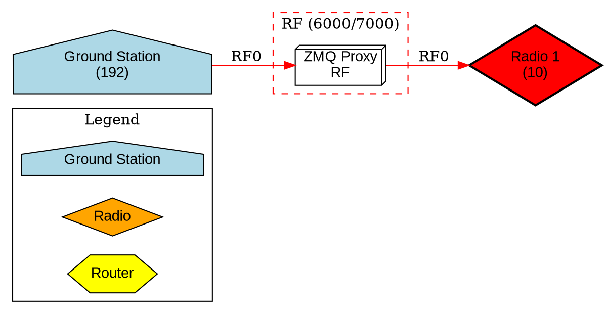

# CSP Virtual Node Implementation Specification

## Overview

This document serves as the high-level specification for the CSP Virtual Topology Simulator implemented in the `csp_virtual_topology/` directory. The system provides a highly configurable CSP-enabled virtual node infrastructure that allows testing of various network topologies using ZMQ as the underlying transport. The implementation enables simulation of multiple CSP nodes with comprehensive packet transit monitoring to validate routing behavior.

## Implementation Summary

**Location:** `csp_virtual_topology/` directory at repository root

**Key Components:**

- **Virtual Node Executable** (`src/csp_virtual_node.c`): C program that runs a single CSP node based on JSON configuration
- **Configuration Parser** (`src/config_parser.c/h`): JSON parser supporting both `"routes"` and `"routing_table"` field names
- **Topology Launcher** (`tools/topology_launcher.py`): Python orchestrator (981 lines) managing all processes
- **Web Dashboard** (`tools/web/`): Flask/SocketIO-based interface on port 9999 for visualization and control
- **Control Hub**: ZMQ ROUTER on port 5555 for command/response routing between orchestrator and nodes
- **ZMQ Proxies**: Multiple proxy processes (one per subnet) for traffic isolation
- **JSON Schema** (`topologies/schema.json`): Comprehensive schema (295 lines) for topology validation

**Key Features:**

- **Multi-Subnet Architecture**: Each network segment (RF, CAN, I2C, etc.) uses separate ZMQ proxy with unique ports
- **Traffic Isolation**: Nodes on different subnets cannot communicate unless routing is properly configured in router nodes
- **Real-Time Web Interface**: Interactive dashboard with topology visualization, node control, and live log tailing
- **Interactive CLI**: Command-line interface for sending commands to nodes
- **Promiscuous Mode**: Comprehensive packet monitoring and logging at node level
- **CMake Build System**: Automated build with dependency detection

**Example Topology:** `satellite_hot_redundant.json` with 7 nodes across 4 isolated subnets (RF, OBC_CAN, GS_CAN, I2C)

## Objectives

1. Create a JSON-configurable virtual CSP node implementation in C
2. Support multiple virtual nodes communicating via ZMQ
3. Enable flexible topology configuration (nodes, interfaces, routing tables)
4. Provide comprehensive packet transit monitoring and logging
5. Validate CSP routing behavior across different network topologies
6. Provide web-based visualization and control interface
7. Support multi-subnet topologies with isolated network segments

## Architecture

### Design Approach: Multi-Process Architecture with Orchestration

**Rationale:** Use separate processes for each virtual node with centralized orchestration and control.

**Benefits:**
- Better isolation between nodes
- Simpler per-node implementation
- More realistic simulation of distributed systems
- Easier debugging and testing
- Centralized control and monitoring via control hub
- Real-time visualization and interaction via web dashboard

### System Components

```
┌─────────────────────────────────────────────────────────────┐
│                    Topology Configuration                    │
│                      (JSON File)                             │
└──────────────────────┬──────────────────────────────────────┘
                       │
                       ▼
┌─────────────────────────────────────────────────────────────┐
│              Topology Launcher (Python)                      │
│  • Orchestration  • Web Dashboard  • Control Hub            │
│  • Port 9999 (Web)  • Port 5555 (Control)                   │
└──┬────────┬──────────┬──────────────┬──────────────────────┘
   │        │          │              │
   │        │          ▼              ▼
   │        │    ┌──────────┐   ┌──────────┐
   │        │    │ ZMQ Proxy│   │ ZMQ Proxy│  ... (Multiple Proxies)
   │        │    │   RF     │   │ OBC_CAN  │
   │        │    │ 6000/7000│   │ 6001/7001│
   │        │    └────┬─────┘   └────┬─────┘
   │        │         │              │
   │        ▼         ▼              ▼
   │   ┌────────┐ ┌────────┐     ┌────────┐
   │   │ Node 1 │ │ Node 2 │ ... │ Node N │
   │   │Process │ │Process │     │Process │
   │   └────────┘ └────────┘     └────────┘
   │
   ▼
┌──────────────────────────────────────┐
│         Control Hub (ZMQ ROUTER)     │
│  • Command/Response routing          │
│  • Node control interface            │
│  • Port 5555                         │
└──────────────────────────────────────┘
```

### Multi-Subnet Architecture with Traffic Isolation

**Key Design Principle:** Each network subnet (RF, CAN, I2C, etc.) uses a separate ZMQ proxy with unique port pairs. This ensures complete traffic isolation between subnets.

**Benefits:**
- **Traffic Isolation:** Nodes on different subnets cannot communicate unless connected via router nodes
- **Routing Validation:** If two nodes on different subnets can communicate, it proves that routing is correctly configured in intermediate router nodes
- **Realistic Network Simulation:** Mimics real hardware where different physical buses are completely isolated
- **Debugging:** Makes it easy to verify that multi-hop routing is working correctly, not just broadcasting to all nodes

**Example Port Allocation:**
- RF subnet: Subscribe 6000, Publish 7000
- OBC_CAN subnet: Subscribe 6001, Publish 7001
- I2C subnet: Subscribe 6002, Publish 7002
- GS_CAN subnet: Subscribe 6003, Publish 7003

This architecture ensures that a packet from a node on the RF subnet can only reach a node on the I2C subnet if there are properly configured router nodes bridging the two subnets.

## JSON Configuration Format

### Schema Design

The configuration schema supports both single-proxy and multi-proxy topologies. The actual schema is defined in `csp_virtual_topology/topologies/schema.json`.

```json
{
  "topology": {
    "name": "string",
    "description": "string",
    "csp_version": 2,
    "deduplication": "all|off",

    "control_hub": {
      "enabled": true,
      "host": "localhost",
      "port": 5555
    },

    "zmq_proxies": [
      {
        "name": "RF",
        "description": "Radio Frequency subnet",
        "host": "localhost",
        "subscribe_port": 6000,
        "publish_port": 7000
      },
      {
        "name": "OBC_CAN",
        "description": "Onboard CAN subnet",
        "host": "localhost",
        "subscribe_port": 6001,
        "publish_port": 7001
      }
    ]
  },
  "nodes": [
    {
      "name": "string",
      "description": "string",
      "type": "ground|radio|router|sensor",
      "interfaces": [
        {
          "name": "string",
          "address": "integer (CSP address for this interface)",
          "netmask": "integer (typically 14 for exact matching)",
          "zmq_proxy": "string (name of ZMQ proxy from zmq_proxies array)",
          "is_default": "boolean"
        }
      ],
      "routes": [
        {
          "address": "integer (destination address)",
          "netmask": "integer (route specificity)",
          "interface": "string (interface name to use)",
          "via": "integer or null (next-hop address, null for direct)",
          "comment": "string (optional documentation)"
        }
      ]
    }
  ],
  "monitoring": {
    "enabled": true,
    "promiscuous_mode": true,
    "track_routing_path": true,
    "detect_duplicates": true,
    "statistics_interval": 5,
    "log_file": "string or null",
    "log_format": "text|json"
  }
}
```

**Note:** The configuration parser supports both `"routes"` and `"routing_table"` field names for backward compatibility.

### Configuration Examples

See the `csp_virtual_topology/topologies/examples/` directory for complete examples:

- `satellite_hot_redundant.json` - Satellite with dual hot-redundant radios, OBC router, and ground station
  - 7 nodes: gs_radio, spaceops, radio1, radio2, obc, router, sensor1
  - 4 subnets: RF, OBC_CAN, GS_CAN, I2C
  - Multi-hop routing across isolated network segments
  - Demonstrates proper routing configuration for multi-subnet communication

- `linear_3node.json` - Simple 3-node linear topology for basic testing

## Implementation Components

All implementation files are located in the `csp_virtual_topology/` directory at the repository root.

### 1. JSON Configuration Parser (`src/config_parser.c/h`)

**Location:** `csp_virtual_topology/src/config_parser.c` and `csp_virtual_topology/src/config_parser.h`

**Dependencies:**

- cJSON library (lightweight JSON parser for C)

**Functionality:**

- Parse JSON topology configuration file
- Validate configuration schema
- Extract node-specific configuration by node name
- Generate CSP routing table strings from JSON routing entries
- Validate addresses, netmasks, and routing consistency
- **Support both `"routes"` and `"routing_table"` field names for backward compatibility**

**Key Functions:**

```c
// Parse entire topology configuration
topology_config_t* parse_topology_config(const char* filename);

// Extract configuration for a specific node
node_config_t* get_node_config(topology_config_t* topology, const char* node_name);

// Generate CSP routing table string from JSON routing entries
char* generate_rtable_string(node_config_t* node);

// Validate configuration
int validate_topology_config(topology_config_t* topology);

// Free configuration structures
void free_topology_config(topology_config_t* topology);
```

**Implementation Note:** The parser checks for both `"routes"` and `"routing_table"` field names when parsing node configurations, ensuring compatibility with different JSON schema versions.

### 2. Virtual Node Program (`src/csp_virtual_node.c`)

**Location:** `csp_virtual_topology/src/csp_virtual_node.c`

**Purpose:** Standalone executable that runs a single CSP node based on JSON configuration.

**Command-line Interface:**

```bash
csp_virtual_node --config <topology.json> --node <node_name> [options]

Options:
  --config FILE     Path to topology JSON configuration file
  --node NAME       Name of the node to run (from config)
  --verbose         Enable verbose logging
  --test-mode       Run in test mode (auto-terminate after duration)
  --duration SEC    Test mode duration in seconds (default: 60)
```

**Functionality:**

- Parse command-line arguments
- Load and parse JSON configuration
- Extract node-specific configuration
- Initialize CSP stack (csp_init)
- Configure ZMQ interface(s) based on JSON (each interface connects to its designated ZMQ proxy)
- Setup routing table from JSON configuration
- **Enable promiscuous mode for packet monitoring**
- **Connect to control hub for command/response interface**
- Start router task
- Run server task (handle incoming connections)
- **Handle control commands (ping, stats, etc.)**
- Graceful shutdown on SIGINT/SIGTERM

**Server Task Features:**

- Echo service (port 10)
- Ping response (CSP service handler)
- Custom application port (configurable)
- Connection statistics
- **Control interface for orchestrator commands**

**Logging Features:**

- Extensive interface initialization logging
- Routing table configuration logging
- Packet transit logging in promiscuous mode
- Per-node log files in topology-specific directories

### 3. Topology Launcher (`tools/topology_launcher.py`)

**Location:** `csp_virtual_topology/tools/topology_launcher.py` (981 lines)

**Purpose:** Python orchestrator script that manages the entire topology simulation lifecycle.

**Core Functionality:**

- Parse JSON topology configuration
- Validate configuration before launch
- **Start control hub (ZMQ ROUTER on port 5555)**
- **Start multiple ZMQ proxy processes (one per subnet)**
- Launch all virtual node processes
- Monitor node health (process alive checks)
- Collect and aggregate logs
- **Provide interactive CLI for sending commands to nodes**
- **Provide web dashboard for visualization and control**
- Generate topology visualization using Graphviz
- Graceful shutdown of all processes
- Handle graceful shutdown (SIGINT)
- Clean up all processes on exit

**Command-line Interface:**

```bash
./tools/topology_launcher.py <topology.json> [options]

Options:
  --build-dir DIR       Path to build directory (default: auto-detect)
  --visualize           Generate topology visualization
  --viz-format FORMAT   Visualization format: png, pdf, svg, dot (default: png)
  --viz-output FILE     Output file for visualization
  --viz-show            Show visualization after generation
  --viz-only            Only generate visualization, don't run topology
  -i, --interactive     Start interactive control interface (CLI)
  --web                 Start web dashboard interface
  --web-port PORT       Web dashboard port (default: 9999)
```

**Interactive CLI Features:**

- Send ping commands to nodes: `ping <node> <dest> [count] [timeout] [size]`
- List all nodes in topology: `nodes`
- Real-time command/response interaction
- Direct control over virtual nodes via control hub

**Web Dashboard Features:**

- **Flask-based web interface on port 9999**
- **Real-time topology visualization**
- **Interactive node control (send ping commands)**
- **Live log tailing for each node**
- **Node status monitoring**
- **SocketIO for real-time updates**
- **Responsive UI with console and log panels**

**Visualization Features:**

- Visual representation of all nodes and their connections
- Different node shapes for different types (ground, radio, router, sensor)
- Color-coded interfaces and network segments
- ZMQ proxies shown as separate network segments
- Routing table information displayed
- Export to multiple formats (PNG, PDF, SVG, DOT)

**Control Hub Implementation:**

- **ZMQ ROUTER socket on port 5555**
- Routes commands from orchestrator to specific nodes
- Routes responses from nodes back to orchestrator
- JSON-based command/response protocol
- Supports commands: `csp_ping`, `stats`, etc.

**Implementation Notes:**

- Uses Python's `subprocess` module for process management
- Monitors process health with periodic checks
- Captures stdout/stderr from all processes
- Provides graceful shutdown with SIGTERM/SIGKILL escalation
- Creates topology-specific log directories (e.g., `Satellite_Hot-Redundant_Radios_with_OBC/`)
- Each node logs to a separate file in the log directory

### 4. ZMQ Proxy Processes

**Purpose:** Simulate network segments (subnets) using ZMQ PUB/SUB pattern.

**Implementation:** Uses the standard `zmqproxy` executable from the csp_es examples.

**Key Characteristics:**

- One proxy process per network subnet (RF, CAN, I2C, etc.)
- Each proxy has unique subscribe/publish port pair
- **Traffic isolation:** Nodes can only communicate within the same subnet unless routing is configured
- Promiscuous mode support for packet monitoring

**Command-line Interface:**

```bash
zmqproxy [options]

Options:
  -s SUB_ADDR       Subscriber address (e.g., tcp://0.0.0.0:6000)
  -p PUB_ADDR       Publisher address (e.g., tcp://0.0.0.0:7000)
  -v VERSION        CSP version (1 or 2, default: 2)
```

**Port Allocation Strategy:**

- Each subnet gets a unique port pair
- Subscribe ports: 6000, 6001, 6002, 6003, ...
- Publish ports: 7000, 7001, 7002, 7003, ...
- **This ensures complete traffic isolation between subnets**
- **Nodes on different subnets can only communicate if routing is properly configured in router nodes**

### 5. Testing and Validation Tools

**Test Ping Script (`test_ping.py`):**

**Location:** `csp_virtual_topology/test_ping.py`

**Purpose:** Send ping commands to nodes via the control hub for testing connectivity.

**Usage:**

```bash
python3 test_ping.py <node> <dest> <count> <timeout> <size>
```

**Features:**

- Send ping commands to specific nodes
- Specify destination address, count, timeout, and packet size
- Receive and display ping results
- Validate multi-hop routing paths

## Implementation Phases

### Phase 1: Foundation (Week 1)

**Tasks:**

1. Add cJSON dependency to build system
   - Update CMakeLists.txt
   - Add cJSON as submodule or external dependency
   - Test JSON parsing functionality

2. Define and document JSON schema
   - Create JSON schema file
   - Write example configurations
   - Document all configuration options

3. Implement configuration parser
   - Create config_parser.c/h
   - Implement parsing functions
   - Add validation logic
   - Write unit tests

**Deliverables:**

- Working JSON parser
- Example configuration files
- Unit tests for parser
- Documentation of JSON schema

### Phase 2: Virtual Node Implementation (Week 2)

**Tasks:**

1. Create csp_virtual_node.c
   - Command-line argument parsing
   - Configuration loading
   - CSP initialization
   - ZMQ interface setup

2. Implement routing table configuration
   - Parse routing entries from JSON
   - Generate CSP rtable strings
   - Apply routing configuration

3. Add server functionality
   - Echo service
   - Ping response
   - Custom port handling
   - Connection management

4. Add client functionality (optional)
   - Automated ping tests
   - Data transfer tests
   - Performance measurements

**Deliverables:**

- Working csp_virtual_node executable
- Support for JSON configuration
- Basic server/client functionality
- Integration tests

### Phase 3: Topology Management (Week 3)

**Tasks:**

1. Create topology launcher script
   - Parse topology configuration
   - Process management
   - ZMQ proxy integration
   - Error handling
   - **Graphviz visualization generation**

2. Implement monitoring integration
   - Start enhanced zmqproxy
   - Collect logs from all nodes
   - Display real-time status

3. Add graceful shutdown
   - Signal handling
   - Process cleanup
   - Resource cleanup

4. Implement visualization generator
   - Parse topology JSON
   - Generate Graphviz DOT format
   - Create visual representation of nodes, interfaces, and connections
   - Support multiple output formats (PNG, SVG, PDF)
   - Color-code different interface types
   - Highlight hot-redundant connections

**Deliverables:**

- Working topology_launcher.py
- Process orchestration
- Log aggregation
- Clean shutdown handling
- **Topology visualization generator**

### Phase 4: Monitoring and Logging (Week 4)

**Tasks:**

1. Enhance zmqproxy
   - Detailed packet logging
   - Statistics collection
   - Multiple output formats
   - Real-time display

2. Implement routing path tracking
   - Track packet forwarding
   - Detect routing loops
   - Identify packet drops

3. Add visualization (optional)
   - Topology graph
   - Traffic flow visualization
   - Statistics dashboard

**Deliverables:**

- Enhanced zmqproxy_enhanced
- Comprehensive logging
- Statistics collection
- Optional visualization tools

### Phase 5: Testing and Documentation (Week 5)

**Tasks:**

1. Create example topologies
   - Linear topology (3 nodes)
   - Star topology (4 nodes)
   - Mesh topology (4 nodes)
   - Subnet topology (6 nodes)
   - Complex multi-hop (5+ nodes)

2. Write test scenarios
   - Basic connectivity tests
   - Multi-hop routing tests
   - Subnet routing tests
   - Failure scenarios
   - Performance tests

3. Documentation
   - User guide
   - Configuration reference
   - Troubleshooting guide
   - Example walkthroughs

**Deliverables:**

- 5+ example topologies
- Test suite
- Complete documentation
- Tutorial/walkthrough

## Directory Structure

The actual implementation is located in the `csp_virtual_topology/` directory at the repository root:

```text
csp_es/
├── csp_virtual_topology/              # Virtual topology simulator (root level)
│   ├── src/                           # Source code
│   │   ├── csp_virtual_node.c         # Virtual node executable
│   │   ├── config_parser.c            # JSON configuration parser
│   │   └── config_parser.h            # Parser header
│   ├── tools/                         # Python tools
│   │   ├── topology_launcher.py       # Main orchestrator (981 lines)
│   │   └── web/                       # Web dashboard
│   │       ├── static/                # CSS, JavaScript
│   │       │   ├── css/
│   │       │   └── js/
│   │       └── templates/             # HTML templates
│   │           └── dashboard.html
│   ├── topologies/                    # Topology configurations
│   │   ├── examples/                  # Example topologies
│   │   │   ├── satellite_hot_redundant.json  # Main example (7 nodes, 4 subnets)
│   │   │   └── linear_3node.json      # Simple 3-node example
│   │   ├── schema.json                # JSON schema definition (295 lines)
│   │   └── test_single_node.json      # Single node test
│   ├── tests/                         # Unit tests
│   │   └── test_config_parser.c       # Config parser tests
│   ├── build/                         # Build artifacts (generated)
│   │   ├── csp_virtual_node           # Virtual node executable
│   │   ├── libconfig_parser.a         # Config parser library
│   │   └── test_config_parser         # Test executable
│   ├── Satellite_Hot-Redundant_Radios_with_OBC/  # Log directory (generated)
│   │   ├── gs_radio.log               # Per-node log files
│   │   ├── spaceops.log
│   │   ├── radio1.log
│   │   ├── radio2.log
│   │   ├── obc.log
│   │   ├── router.log
│   │   └── sensor1.log
│   ├── CMakeLists.txt                 # Build configuration
│   ├── README.md                      # Project documentation
│   ├── test_ping.py                   # Ping test script
│   ├── test_routing.sh                # Routing test script
│   └── .gitignore                     # Git ignore rules
└── CSP_VIRTUAL_NODE_IMPLEMENTATION_PLAN.md  # This specification document
```

**Key Directories:**

- **`src/`**: C source code for virtual nodes and configuration parser
- **`tools/`**: Python orchestrator and web dashboard
- **`topologies/`**: JSON configuration files and schema
- **`tests/`**: Unit tests for components
- **`build/`**: CMake build artifacts (not in version control)
- **`<Topology_Name>/`**: Generated log directories for each topology run

## Example Topology Configurations

### 1. Satellite Hot-Redundant Radios with OBC

**Description:** Satellite with dual hot-redundant radios, OBC router, and ground station with space operations center

**Use Case:** Test multi-subnet routing with complete traffic isolation between network segments

**Configuration:** `csp_virtual_topology/topologies/examples/satellite_hot_redundant.json`

**Network Architecture:**

- **4 Isolated Subnets** (each with its own ZMQ proxy):
  - **RF** (6000/7000): Radio frequency communication
  - **OBC_CAN** (6001/7001): Onboard CAN bus
  - **I2C** (6002/7002): Internal I2C bus
  - **GS_CAN** (6003/7003): Ground station CAN bus

- **7 Nodes:**
  - **gs_radio**: Ground station radio (RF + GS_CAN interfaces)
  - **spaceops**: Space operations center (GS_CAN interface)
  - **radio1**: Primary satellite radio (RF + OBC_CAN interfaces)
  - **radio2**: Backup satellite radio (RF + OBC_CAN interfaces)
  - **obc**: Onboard computer router (OBC_CAN + I2C interfaces)
  - **router**: Internal I2C router (I2C interface)
  - **sensor1**: Temperature sensor (I2C interface)

**Key Design Features:**

- **Traffic Isolation:** Each subnet uses different ZMQ ports, ensuring nodes on different subnets cannot communicate unless routing is properly configured
- **Multi-Interface Nodes:** Router nodes (gs_radio, radio1, radio2, obc) have interfaces on multiple subnets with unique addresses per interface
- **Routing Validation:** Communication between spaceops (GS_CAN) and sensor1 (I2C) requires correct routing through gs_radio → radio1 → obc → router, proving multi-hop routing works correctly

**Example Routing Path (spaceops → sensor1):**

```text
spaceops (addr 3, GS_CAN)
  → gs_radio (addr 2→1, GS_CAN→RF)
  → radio1 (addr 10→11, RF→OBC_CAN)
  → obc (addr 14→15, OBC_CAN→I2C)
  → router (addr 16, I2C)
  → sensor1 (addr 20, I2C)
```

This path crosses 4 different isolated subnets, demonstrating that routing is correctly configured.

**Configuration Excerpt:**

```json
{
  "topology": {
    "name": "Satellite Hot-Redundant Radios with OBC",
    "csp_version": 2,
    "deduplication": "all",
    "control_hub": {
      "enabled": true,
      "port": 5555
    },
    "zmq_proxies": [
      {
        "name": "RF",
        "subscribe_port": 6000,
        "publish_port": 7000
      },
      {
        "name": "OBC_CAN",
        "subscribe_port": 6001,
        "publish_port": 7001
      },
      {
        "name": "I2C",
        "subscribe_port": 6002,
        "publish_port": 7002
      },
      {
        "name": "GS_CAN",
        "subscribe_port": 6003,
        "publish_port": 7003
      }
    ]
  },
  "nodes": [
    {
      "name": "radio1",
      "type": "radio",
      "interfaces": [
        {
          "name": "RF_IF",
          "address": 10,
          "netmask": 14,
          "zmq_proxy": "RF",
          "is_default": true
        },
        {
          "name": "OBC_CAN_IF",
          "address": 11,
          "netmask": 14,
          "zmq_proxy": "OBC_CAN"
        }
      ],
      "routes": [
        {
          "address": 1,
          "netmask": 14,
          "interface": "RF_IF",
          "via": null,
          "comment": "Route to gs_radio via RF"
        },
        {
          "address": 20,
          "netmask": 14,
          "interface": "OBC_CAN_IF",
          "via": 14,
          "comment": "Route to sensors via OBC"
        }
      ]
    }
  ]
}
```

**Expected Behavior:**

- Ground station can communicate with satellite sensors via multi-hop routing
- Hot-redundant radios provide backup paths
- Traffic isolation ensures routing is validated (not just broadcast)
- All packets logged per-node in topology-specific log directory

### 2. Linear 3-Node Topology

**Description:** Three nodes in a line: Node1 <-> Node2 <-> Node3

**Use Case:** Test basic multi-hop routing on a single subnet

**Configuration:** `csp_virtual_topology/topologies/examples/linear_3node.json`

```json
{
  "topology": {
    "name": "linear_3node",
    "description": "Three nodes in linear configuration",
    "csp_version": 2,
    "zmq_proxy": {
      "host": "localhost",
      "subscribe_port": 6000,
      "publish_port": 7000
    }
  },
  "nodes": [
    {
      "name": "node1",
      "interfaces": [
        {
          "name": "ZMQ0",
          "driver": "zmq",
          "address": 1,
          "netmask": 8,
          "is_default": true
        }
      ],
      "routing_table": [
        {
          "address": 0,
          "netmask": 0,
          "interface": "ZMQ0",
          "via": null
        }
      ]
    },
    {
      "name": "node2",
      "interfaces": [
        {
          "name": "ZMQ0",
          "driver": "zmq",
          "address": 2,
          "netmask": 8,
          "is_default": true
        }
      ],
      "routing_table": [
        {
          "address": 0,
          "netmask": 0,
          "interface": "ZMQ0",
          "via": null
        }
      ]
    },
    {
      "name": "node3",
      "interfaces": [
        {
          "name": "ZMQ0",
          "driver": "zmq",
          "address": 3,
          "netmask": 8,
          "is_default": true
        }
      ],
      "routing_table": [
        {
          "address": 0,
          "netmask": 0,
          "interface": "ZMQ0",
          "via": null
        }
      ]
    }
  ],
  "monitoring": {
    "enabled": true,
    "log_file": "linear_3node.log",
    "log_format": "text",
    "promiscuous_mode": true
  }
}
```

**Expected Behavior:**

- Node1 can ping Node2 directly
- Node1 can ping Node3 via Node2 (2 hops)
- Node3 can ping Node1 via Node2 (2 hops)
- All packets logged by monitoring

### 2. Star 4-Node Topology

**Description:** Central hub connected to 3 leaf nodes

**Configuration:** `topologies/examples/star_4node.json`

**Routing:**

- Hub (Node 10): Routes to all leaf nodes (1, 2, 3)
- Leaf nodes: Route everything via hub

### 3. Subnet Topology

**Description:** Two subnets connected via router

**Subnets:**

- Subnet A: 0/8 (addresses 0-63)
- Subnet B: 64/8 (addresses 64-127)
- Router: Node 50 (bridges both subnets)

## Technical Considerations

### Multiple Interfaces per Node

**Challenge:** CSP nodes may have multiple interfaces, but ZMQ uses a single proxy.

**Solution:**

- Use CSP addressing to differentiate traffic
- Each node connects to the same ZMQ proxy
- Routing table determines which interface to use
- Interface names are logical (for configuration clarity)

### Packet Monitoring Strategy

**Approach:** Monitor at ZMQ proxy level (centralized)

**Advantages:**

- No performance impact on nodes
- Complete visibility of all traffic
- Centralized logging
- No need for promiscuous mode on nodes

**Implementation:**

- Enhanced zmqproxy subscribes to all traffic
- Parses CSP headers
- Logs packet details
- Tracks routing paths
- Collects statistics

### Routing Table Configuration

**JSON to CSP Format Conversion:**

JSON routing entry:

```json
{
  "address": 10,
  "netmask": 5,
  "interface": "ZMQ0",
  "via": 2
}
```

Converts to CSP rtable string: `"10/5 ZMQ0 2"`

Multiple entries are comma-separated: `"0/0 ZMQ0, 10/5 ZMQ1 2"`

### Topology Visualization Implementation

**Purpose:** Generate visual diagrams of the network topology from JSON configuration.

**Technology:** Graphviz (DOT language) via Python graphviz library

**Implementation Details:**

The visualization generator (`topology_visualizer.py` module within `topology_launcher.py`) performs the following:

1. **Parse JSON Configuration:**
   - Extract all nodes, interfaces, and ZMQ proxies
   - Identify node types (ground, radio, router, sensor, I2C device)
   - Extract routing table information

2. **Generate Graphviz DOT:**
   - Create main graph with appropriate layout (dot, neato, fdp)
   - Define node styles based on type
   - Create subgraphs for ZMQ proxies
   - Add edges for connections between nodes and proxies
   - Label edges with interface names
   - Color-code by interface type

3. **Render Output:**
   - Support multiple formats: PNG, SVG, PDF
   - Optionally open in default viewer
   - Save to specified output path

**Node Styling:**

```python
node_styles = {
    'ground': {'shape': 'house', 'fillcolor': 'lightblue', 'style': 'filled'},
    'radio': {'shape': 'diamond', 'fillcolor': 'orange', 'style': 'filled'},
    'radio_redundant': {'shape': 'diamond', 'fillcolor': 'red', 'style': 'filled,bold'},
    'router': {'shape': 'hexagon', 'fillcolor': 'yellow', 'style': 'filled'},
    'regular': {'shape': 'ellipse', 'fillcolor': 'lightgray', 'style': 'filled'},
    'sensor': {'shape': 'box', 'fillcolor': 'lightgreen', 'style': 'filled'},
    'i2c': {'shape': 'box', 'fillcolor': 'lightyellow', 'style': 'filled,rounded'}
}
```

**Interface Colors:**

```python
interface_colors = {
    'RF': 'red',
    'CAN': 'blue',
    'SENSOR_CAN': 'lightblue',
    'I2C': 'green'
}
```

**Example DOT Output Structure:**



**Features:**

- Automatic node type detection based on configuration
- Hot-redundant nodes highlighted with bold borders
- ZMQ proxies shown as clusters
- Interface types color-coded
- Node addresses displayed
- Routing paths can be overlaid (optional)
- Legend included automatically
- Scalable to large topologies

### Configuration Validation

**Checks to Implement:**

1. **Address Conflicts:** No two interfaces on different nodes should have the same address
2. **Routing Consistency:** All routing table entries reference valid interfaces
3. **Netmask Validity:** Netmask values are within valid range (0 to max host bits)
4. **Reachability:** All nodes should be reachable (at least via default route)
5. **Interface References:** Routing table entries reference existing interfaces

### Error Handling

**Node Startup Failures:**

- Log detailed error messages
- Fail fast with clear error codes
- Validate configuration before starting processes

**ZMQ Connection Issues:**

- Retry logic with exponential backoff
- Timeout configuration
- Clear error reporting

**Routing Failures:**

- Detect and log routing loops
- Report unreachable destinations
- Track packet drops

## Testing Strategy

### Unit Tests

- Configuration parser validation
- Routing table string generation
- JSON schema validation
- Error handling

### Integration Tests

1. **Basic Connectivity:** Two nodes can communicate
2. **Multi-hop Routing:** Packets traverse multiple nodes
3. **Subnet Routing:** Cross-subnet communication works
4. **Routing Table Updates:** Dynamic routing changes
5. **Failure Scenarios:** Node failures, network partitions

### Performance Tests

- Maximum number of concurrent nodes
- Packet throughput
- Latency measurements
- Memory usage
- CPU utilization

### Validation Tests

- Verify routing paths match expectations
- Confirm packet delivery
- Check for packet loss
- Validate routing table application

## Success Criteria

1. ✅ Successfully parse JSON topology configurations
2. ✅ Launch multiple virtual nodes from configuration
3. ✅ Establish CSP communication via ZMQ between nodes
4. ✅ Correctly route packets through multi-hop paths
5. ✅ Monitor and log all packet transits
6. ✅ Detect and report routing failures
7. ✅ Support at least 10 concurrent virtual nodes
8. ✅ Handle various topology configurations (linear, star, mesh, subnet)
9. ✅ Provide clear error messages for configuration issues
10. ✅ Enable easy topology switching via JSON files
11. ✅ **Generate visual topology diagrams using Graphviz**

## Dependencies

### Required Libraries (C)

- **csp_es:** CSP library (must be installed or in CMAKE_PREFIX_PATH)
- **cJSON:** JSON parsing library
  - Ubuntu/Debian: `sudo apt-get install libcjson-dev`
  - Fedora/RHEL: `sudo dnf install cjson-devel`
- **libzmq:** ZeroMQ messaging library
  - Ubuntu/Debian: `sudo apt-get install libzmq3-dev`
  - Fedora/RHEL: `sudo dnf install zeromq-devel`

### Required Python Packages

- **Python 3:** For topology launcher and web dashboard
- **Flask:** Web framework for dashboard
  - Install: `pip install flask`
- **Flask-SocketIO:** Real-time communication for web dashboard
  - Install: `pip install flask-socketio`
- **graphviz:** Python bindings for Graphviz (topology visualization)
  - Install: `pip install graphviz`
  - Requires Graphviz system package to be installed
- **pyzmq:** Python ZMQ bindings
  - Install: `pip install pyzmq`

### Required System Packages

- **Graphviz:** Graph visualization software
  - Ubuntu/Debian: `sudo apt-get install graphviz`
  - Fedora/RHEL: `sudo dnf install graphviz`
  - macOS: `brew install graphviz`

### Build System

**Location:** `csp_virtual_topology/CMakeLists.txt`

**Build Process:**

```bash
# Create build directory
cd csp_virtual_topology
mkdir build && cd build

# Configure (csp_es must be installed or in CMAKE_PREFIX_PATH)
cmake ..

# Build
make

# Install (optional)
sudo make install
```

**CMakeLists.txt Key Features:**

```cmake
# Find dependencies
find_package(csp_es REQUIRED)
find_package(PkgConfig REQUIRED)
pkg_check_modules(CJSON REQUIRED libcjson)
pkg_check_modules(ZMQ REQUIRED libzmq)

# Config parser library
add_library(config_parser STATIC
    src/config_parser.c
    src/config_parser.h
)

# Virtual node executable
add_executable(csp_virtual_node src/csp_virtual_node.c)
target_link_libraries(csp_virtual_node
    config_parser
    csp_es::csp_es
    ${CJSON_LIBRARIES}
    ${ZMQ_LIBRARIES}
)

# Tests
add_executable(test_config_parser tests/test_config_parser.c)
target_link_libraries(test_config_parser config_parser ${CJSON_LIBRARIES})
```

## Usage Examples

### Running a Topology

```bash
# Navigate to the csp_virtual_topology directory
cd csp_virtual_topology

# Start topology (web dashboard starts automatically on http://localhost:9999)
python3 tools/topology_launcher.py topologies/examples/satellite_hot_redundant.json

# Open browser to http://localhost:9999
# - View topology visualization
# - Send ping commands to nodes
# - Monitor real-time logs
# - Check node status
# - Run traceroute tests
# - Edit topology in real-time

# Use custom web port if needed
python3 tools/topology_launcher.py topologies/examples/satellite_hot_redundant.json --web-port 8080

# Stop topology (Ctrl+C in launcher terminal)
```

### Running a Topology with Interactive CLI (Legacy)

```bash
# Start topology with interactive CLI
python3 tools/topology_launcher.py topologies/examples/satellite_hot_redundant.json -i

# Available commands:
control> nodes                          # List all nodes
control> ping radio1 20 5 1000 100     # Ping from radio1 to address 20
control> quit                           # Exit

# View logs in topology-specific directory
tail -f Satellite_Hot-Redundant_Radios_with_OBC/radio1.log
```

### Testing Connectivity with test_ping.py

```bash
# Send ping command to a specific node
python3 test_ping.py radio1 20 5 2000 100

# Arguments: <node> <dest> <count> <timeout_ms> <size>
# - node: Name of the node to send ping from
# - dest: Destination CSP address
# - count: Number of pings
# - timeout_ms: Timeout in milliseconds
# - size: Ping packet size in bytes
```

### Generating Topology Visualization

```bash
# Generate visualization only (don't run topology)
python3 tools/topology_launcher.py topologies/examples/satellite_hot_redundant.json \
    --visualize --viz-show --viz-only

# Generate in different formats
python3 tools/topology_launcher.py topologies/examples/satellite_hot_redundant.json \
    --visualize --viz-format pdf --viz-output my_topology.pdf
```

### Creating a Custom Topology

```bash
# 1. Copy example configuration
cp topologies/examples/satellite_hot_redundant.json topologies/my_topology.json

# 2. Edit configuration
vim topologies/my_topology.json

# 3. Validate against schema (optional)
# Use a JSON schema validator with topologies/schema.json

# 4. Run topology
./tools/topology_launcher.py topologies/my_topology.json
```

### Generating Topology Visualization

```bash
# Generate visualization only (without running topology)
./tools/topology_launcher.py topologies/satellite_hot_redundant.json \
    --visualize --no-run --viz-format svg --viz-output satellite_topology.svg

# Generate and open visualization
./tools/topology_launcher.py topologies/satellite_hot_redundant.json \
    --visualize --viz-show --no-run

# Run topology with automatic visualization generation
./tools/topology_launcher.py topologies/satellite_hot_redundant.json --visualize

# Run without visualization
./tools/topology_launcher.py topologies/satellite_hot_redundant.json --no-visualize
```

**Visualization Output Example:**

The generated visualization will show:

- **Nodes:** Different shapes for different types
  - Ground stations: House shape
  - Radios: Diamond shape (hot-redundant radios in red)
  - Routers: Hexagon shape
  - Regular nodes: Ellipse
  - Sensors: Box shape
  - I2C devices: Rounded box

- **ZMQ Proxies:** Shown as clusters/subgraphs
  - RF proxy (red cluster)
  - Primary CAN proxy (blue cluster)
  - Sensor CAN proxy (light blue cluster)
  - I2C proxy (green cluster)

- **Connections:** Labeled edges showing interface names
  - RF connections: Red arrows
  - CAN connections: Blue arrows
  - I2C connections: Green arrows

- **Labels:** Node addresses, interface names, proxy ports

- **Legend:** Color and shape meanings

## Advanced Topology Example: Satellite with Hot-Redundant Radios

### Topology Description

This example demonstrates a realistic satellite topology with:

- **Ground Segment:** Ground station with RF interface
- **Space Segment - RF Layer:** Two S-Band radios in hot-redundancy (both active)
- **Space Segment - Primary CAN Bus:** Multiple nodes including OBC and routers
- **Space Segment - Sensor CAN Bus:** Sensor nodes accessed via router
- **Space Segment - I2C Bus:** I2C devices accessed via router

### Network Architecture

```text
Ground Segment:
  ┌─────────────────┐
  │ Ground Station  │
  │   (Node 192)    │
  │   RF Interface  │
  └────────┬────────┘
           │ RF (ZMQ Proxy 6000/7000)
           │
    ┌──────┴──────┐
    │             │
Space Segment:
┌───▼────┐    ┌───▼────┐
│ Radio1 │    │ Radio2 │  (Hot-Redundant)
│ (N 10) │    │ (N 11) │
│ RF+CAN │    │ RF+CAN │
└───┬────┘    └───┬────┘
    │             │
    └──────┬──────┘
           │ Primary CAN (ZMQ Proxy 6010/7010)
    ┌──────┼──────┬──────┬──────┬──────┐
    │      │      │      │      │      │
┌───▼──┐ ┌▼───┐ ┌▼───┐ ┌▼─────▼─┐  ┌─▼────────┐
│ OBC  │ │Node│ │Node│ │CAN-Sens│  │CAN-I2C   │
│ (N1) │ │(N2)│ │(N3)│ │Router  │  │Router    │
└──────┘ └────┘ └────┘ │ (N 20) │  │ (N 21)   │
                        │ CAN+CAN│  │ CAN+I2C  │
                        └───┬────┘  └────┬─────┘
                            │            │
         Sensor CAN ────────┘            └──── I2C Bus
    (ZMQ Proxy 6020/7020)           (ZMQ Proxy 6030/7030)
            │                            │
    ┌───────┼────────┐          ┌────────┼────────┐
    │       │        │          │        │        │
┌───▼──┐ ┌──▼──┐ ┌──▼──┐   ┌───▼──┐ ┌───▼──┐ ┌──▼──┐
│Sens30│ │Sens │ │Sens │   │I2C 40│ │I2C 41│ │I2C  │
└──────┘ │ 31  │ │ 32  │   └──────┘ └──────┘ │ 42  │
         └─────┘ └─────┘                      └─────┘
```

### Configuration File: `satellite_hot_redundant.json`

```json
{
  "topology": {
    "name": "satellite_hot_redundant",
    "description": "Satellite with hot-redundant S-Band radios and multi-bus architecture",
    "csp_version": 2,
    "deduplication": "all",
    "zmq_proxies": [
      {
        "name": "RF",
        "description": "S-Band RF interface",
        "subscribe_port": 6000,
        "publish_port": 7000
      },
      {
        "name": "PRIMARY_CAN",
        "description": "Primary onboard CAN bus",
        "subscribe_port": 6010,
        "publish_port": 7010
      },
      {
        "name": "SENSOR_CAN",
        "description": "Sensor CAN bus",
        "subscribe_port": 6020,
        "publish_port": 7020
      },
      {
        "name": "I2C_BUS",
        "description": "I2C bus",
        "subscribe_port": 6030,
        "publish_port": 7030
      }
    ]
  },
  "nodes": [
    {
      "name": "ground_station",
      "description": "Ground station with RF link",
      "interfaces": [
        {
          "name": "RF0",
          "driver": "zmq",
          "zmq_proxy": "RF",
          "address": 192,
          "netmask": 8,
          "is_default": true
        }
      ],
      "routing_table": [
        {
          "address": 0,
          "netmask": 8,
          "interface": "RF0",
          "via": null,
          "comment": "Route to space segment via RF"
        }
      ]
    },
    {
      "name": "sband_radio_1",
      "description": "Primary S-Band radio (hot-redundant)",
      "interfaces": [
        {
          "name": "RF0",
          "driver": "zmq",
          "zmq_proxy": "RF",
          "address": 10,
          "netmask": 8,
          "is_default": false
        },
        {
          "name": "CAN0",
          "driver": "zmq",
          "zmq_proxy": "PRIMARY_CAN",
          "address": 10,
          "netmask": 8,
          "is_default": true
        }
      ],
      "routing_table": [
        {
          "address": 192,
          "netmask": 8,
          "interface": "RF0",
          "via": null,
          "comment": "Route to ground via RF"
        },
        {
          "address": 0,
          "netmask": 8,
          "interface": "CAN0",
          "via": null,
          "comment": "Route to space segment via CAN"
        }
      ]
    },
    {
      "name": "sband_radio_2",
      "description": "Secondary S-Band radio (hot-redundant)",
      "interfaces": [
        {
          "name": "RF0",
          "driver": "zmq",
          "zmq_proxy": "RF",
          "address": 11,
          "netmask": 8,
          "is_default": false
        },
        {
          "name": "CAN0",
          "driver": "zmq",
          "zmq_proxy": "PRIMARY_CAN",
          "address": 11,
          "netmask": 8,
          "is_default": true
        }
      ],
      "routing_table": [
        {
          "address": 192,
          "netmask": 8,
          "interface": "RF0",
          "via": null,
          "comment": "Route to ground via RF"
        },
        {
          "address": 0,
          "netmask": 8,
          "interface": "CAN0",
          "via": null,
          "comment": "Route to space segment via CAN"
        }
      ]
    },
    {
      "name": "obc",
      "description": "Onboard computer",
      "interfaces": [
        {
          "name": "CAN0",
          "driver": "zmq",
          "zmq_proxy": "PRIMARY_CAN",
          "address": 1,
          "netmask": 8,
          "is_default": true
        }
      ],
      "routing_table": [
        {
          "address": 0,
          "netmask": 0,
          "interface": "CAN0",
          "via": null,
          "comment": "Default route via CAN"
        }
      ]
    },
    {
      "name": "can_sensor_router",
      "description": "Router between primary CAN and sensor CAN",
      "interfaces": [
        {
          "name": "CAN0",
          "driver": "zmq",
          "zmq_proxy": "PRIMARY_CAN",
          "address": 20,
          "netmask": 8,
          "is_default": false
        },
        {
          "name": "CAN1",
          "driver": "zmq",
          "zmq_proxy": "SENSOR_CAN",
          "address": 20,
          "netmask": 8,
          "is_default": true
        }
      ],
      "routing_table": [
        {
          "address": 30,
          "netmask": 6,
          "interface": "CAN1",
          "via": null,
          "comment": "Route to sensor nodes via sensor CAN"
        },
        {
          "address": 0,
          "netmask": 0,
          "interface": "CAN0",
          "via": null,
          "comment": "Default route via primary CAN"
        }
      ]
    },
    {
      "name": "can_i2c_router",
      "description": "Router between CAN and I2C bus",
      "interfaces": [
        {
          "name": "CAN0",
          "driver": "zmq",
          "zmq_proxy": "PRIMARY_CAN",
          "address": 21,
          "netmask": 8,
          "is_default": false
        },
        {
          "name": "I2C0",
          "driver": "zmq",
          "zmq_proxy": "I2C_BUS",
          "address": 21,
          "netmask": 8,
          "is_default": true
        }
      ],
      "routing_table": [
        {
          "address": 40,
          "netmask": 6,
          "interface": "I2C0",
          "via": null,
          "comment": "Route to I2C devices"
        },
        {
          "address": 0,
          "netmask": 0,
          "interface": "CAN0",
          "via": null,
          "comment": "Default route via CAN"
        }
      ]
    },
    {
      "name": "sensor_30",
      "description": "Temperature sensor",
      "interfaces": [
        {
          "name": "CAN0",
          "driver": "zmq",
          "zmq_proxy": "SENSOR_CAN",
          "address": 30,
          "netmask": 8,
          "is_default": true
        }
      ],
      "routing_table": [
        {
          "address": 0,
          "netmask": 0,
          "interface": "CAN0",
          "via": null
        }
      ]
    },
    {
      "name": "sensor_31",
      "description": "Pressure sensor",
      "interfaces": [
        {
          "name": "CAN0",
          "driver": "zmq",
          "zmq_proxy": "SENSOR_CAN",
          "address": 31,
          "netmask": 8,
          "is_default": true
        }
      ],
      "routing_table": [
        {
          "address": 0,
          "netmask": 0,
          "interface": "CAN0",
          "via": null
        }
      ]
    },
    {
      "name": "i2c_device_40",
      "description": "I2C magnetometer",
      "interfaces": [
        {
          "name": "I2C0",
          "driver": "zmq",
          "zmq_proxy": "I2C_BUS",
          "address": 40,
          "netmask": 8,
          "is_default": true
        }
      ],
      "routing_table": [
        {
          "address": 0,
          "netmask": 0,
          "interface": "I2C0",
          "via": null
        }
      ]
    }
  ],
  "monitoring": {
    "enabled": true,
    "log_file": "satellite_hot_redundant.log",
    "log_format": "text",
    "promiscuous_mode": true,
    "track_routing_path": true,
    "detect_duplicates": true,
    "statistics_interval": 5
  },
  "test_scenarios": [
    {
      "name": "ground_to_obc",
      "description": "Test ground to OBC communication",
      "source": 192,
      "destination": 1,
      "expected_hops": 2,
      "expected_path": "192 -> 10|11 -> 1"
    },
    {
      "name": "ground_to_sensor",
      "description": "Test ground to sensor multi-hop",
      "source": 192,
      "destination": 30,
      "expected_hops": 3,
      "expected_path": "192 -> 10|11 -> 20 -> 30"
    },
    {
      "name": "ground_to_i2c",
      "description": "Test ground to I2C device",
      "source": 192,
      "destination": 40,
      "expected_hops": 3,
      "expected_path": "192 -> 10|11 -> 21 -> 40"
    }
  ]
}
```

### Key Features of This Topology

1. **Hot-Redundant Radios:**
   - Both Radio 1 (Node 10) and Radio 2 (Node 11) are active
   - Both receive RF traffic from ground
   - Both forward to primary CAN bus
   - Creates duplicate packets (tests CSP deduplication)

2. **Multiple Physical Interfaces:**
   - RF interface (simulated via ZMQ proxy on 6000/7000)
   - Primary CAN (ZMQ proxy on 6010/7010)
   - Sensor CAN (ZMQ proxy on 6020/7020)
   - I2C bus (ZMQ proxy on 6030/7030)

3. **Multi-hop Routing:**
   - Ground → Radio → CAN → Router → Sensor CAN → Sensor (4 hops)
   - Ground → Radio → CAN → Router → I2C → Device (4 hops)

4. **Router Nodes:**
   - CAN-to-Sensor router (Node 20) bridges two CAN buses
   - CAN-to-I2C router (Node 21) bridges CAN and I2C

### Testing Hot-Redundancy

**Test 1: Both Radios Active with Deduplication**

```bash
# Run topology with deduplication enabled (default)
./tools/topology_launcher.py topologies/satellite_hot_redundant.json

# Send ping from ground to sensor
./build/tools/csp_ping_tool --source 192 --target 30 --count 10

# Expected: Single response per ping (duplicates filtered)
# Monitor log should show both radios forwarding, but dedup working
```

**Test 2: Both Radios Active without Deduplication**

Modify configuration: `"deduplication": "off"`

```bash
# Expected: Duplicate responses (both radios forward)
# Monitor should show duplicate packets
```

**Test 3: Single Radio Failure**

```bash
# Kill Radio 2 process
kill <radio2_pid>

# Expected: Communication continues via Radio 1
# No packet loss
```

### Expected Monitoring Output

```text
[2024-03-02 10:15:23.456] PKT: Src=192 Dst=30 Sport=50 Dport=10 Pri=2 Flags=0x00 Size=64
[2024-03-02 10:15:23.457] ROUTE: 192 -> [RF] -> 10 [Radio1] -> [CAN] -> 20 [Router] -> [SENSOR_CAN] -> 30
[2024-03-02 10:15:23.458] DUPLICATE: Same packet via Radio2 (Node 11) - FILTERED
[2024-03-02 10:15:23.459] STATS: Radios: R1_TX=150 R2_TX=150 | Dedup: 75 filtered
```

## Future Enhancements

1. **Web-based Visualization:** Real-time topology and traffic visualization
2. **Dynamic Topology Changes:** Add/remove nodes at runtime
3. **Failure Injection:** Simulate node/link failures
4. **Performance Profiling:** Detailed performance analysis tools
5. **Configuration GUI:** Graphical topology editor
6. **Automated Testing:** Continuous integration test suite
7. **Docker Support:** Containerized node deployment
8. **Multiple Transport Support:** Add UDP, CAN, etc. alongside ZMQ
9. **Radio Link Simulation:** Add latency, packet loss, bit errors
10. **Power Management:** Simulate node sleep/wake cycles

## Conclusion

This implementation plan provides a comprehensive approach to creating a flexible, JSON-configurable CSP virtual node system for testing network topologies. The multi-process architecture with centralized monitoring enables realistic simulation of distributed CSP networks while maintaining simplicity and debuggability.

The advanced satellite topology example demonstrates the system's capability to simulate complex, real-world scenarios including hot-redundant radios, multi-bus architectures, and multi-hop routing. This enables thorough testing of CSP routing behavior, deduplication, and redundancy mechanisms.

The phased implementation approach ensures steady progress with clear deliverables at each stage. The extensive testing strategy and example topologies will validate the system's correctness and usability.

Upon completion, this system will enable thorough testing of CSP routing behavior across various network configurations, helping identify and resolve routing issues before deployment in real systems.
